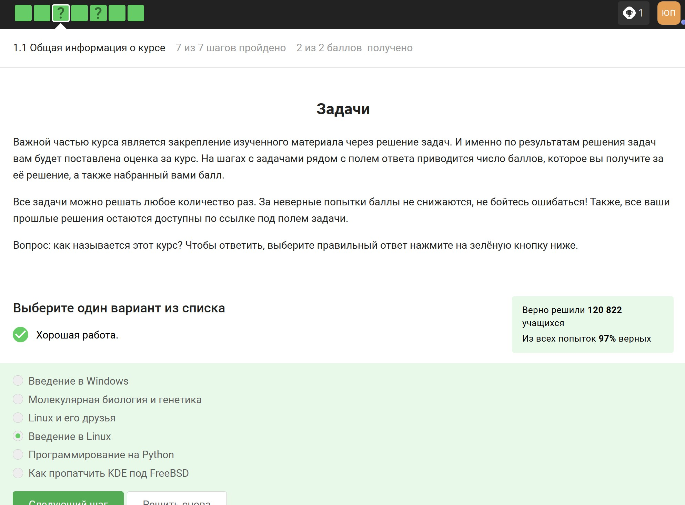
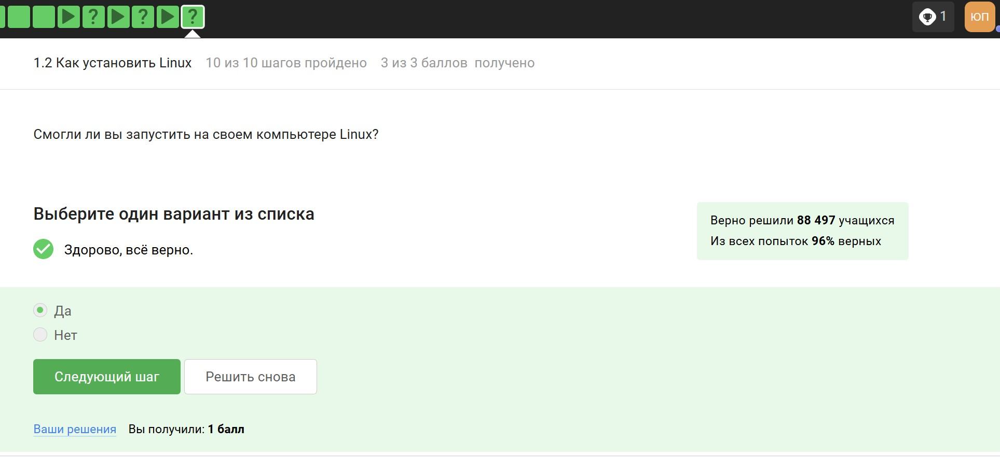
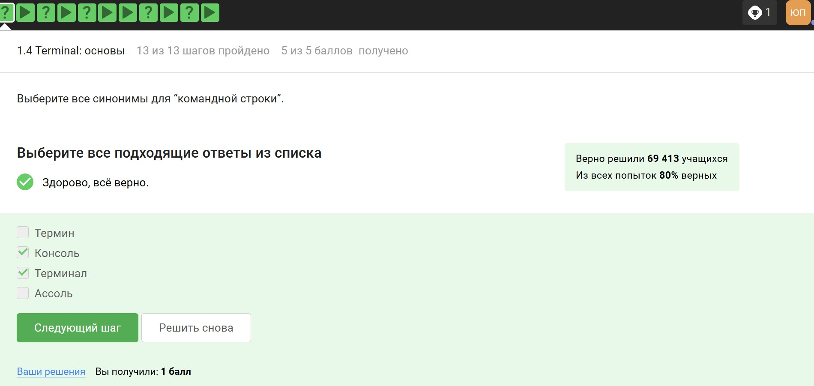
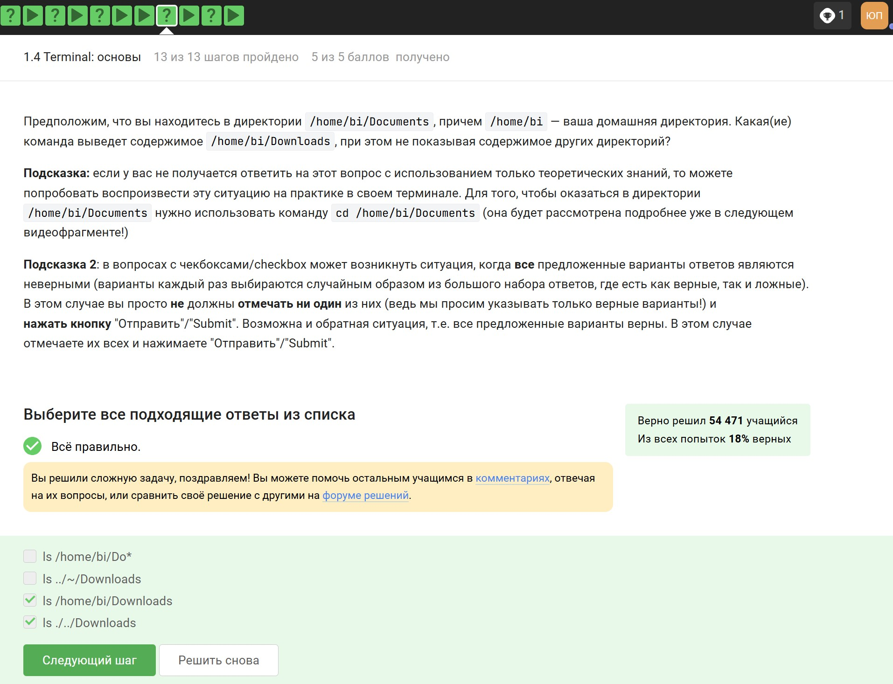
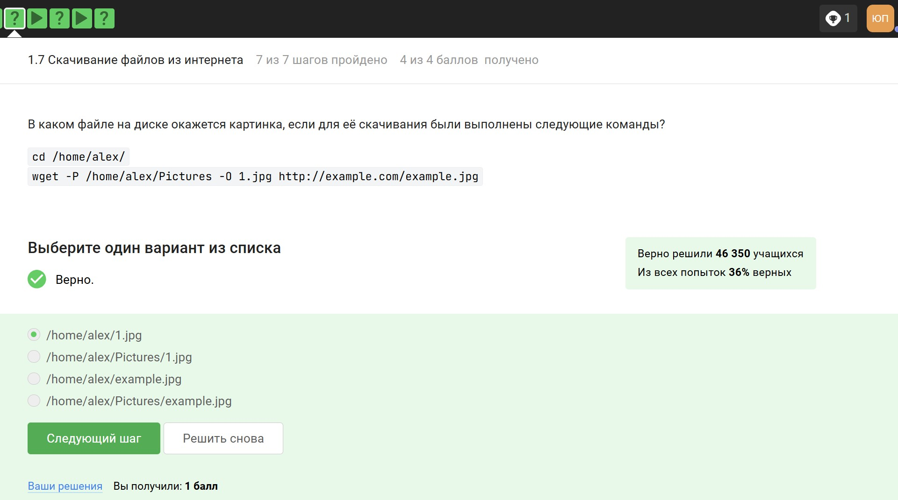
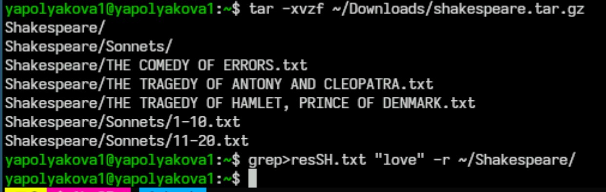

---
## Front matter
lang: ru-RU
title: Внешний курс
subtitle: Раздел 1
author:
  - Полякова Ю.А.
institute:
  - Российский университет дружбы народов, Москва, Россия
  - Преподаватель Кулябов Д. С., д.ф.\-м.н., профессор
date: 28 февраля 2007

## i18n babel
babel-lang: russian
babel-otherlangs: english

## Formatting pdf
toc: false
toc-title: Содержание
slide_level: 2
aspectratio: 169
section-titles: true
theme: metropolis
header-includes:
 - \metroset{progressbar=frametitle,sectionpage=progressbar,numbering=fraction}
---

# Информация

## Докладчик

:::::::::::::: {.columns align=center}
::: {.column width="70%"}

  * Полякова Юлия Александровна
  * Студент
  * Российский университет дружбы народов
  * [yulya.polyakova.07@mail.ru](mailto:yulya.polyakova.07@mail.ru)
  * <https://github.com/JuliaMaffin123>

:::
::: {.column width="30%"}

:::
::::::::::::::

# Вводная часть

## Актуальность

- Прохождение этого внешнего курса даст полензные необходимые в дальнейшем базовые знания по работе с Linux

## Объект и предмет исследования

- Установка Linux
- Работа с терминалом
- Работа с файлами и архивами

## Цели и задачи

- Цель: Получить базовые знания по работе с терминалом и файлами
- Задачи:
	- Изучить теорию
	- Выполнить тестовые и интерактивные задания в курсе

## Материалы и методы

- редактор gedit
- терминал
- stepik

# Выполнение раздела

# Часть "Общая информация о курсе".

## Шаг 3

Название курса можно посмотреть в левом верхнем углу.

{#fig:001 width=55%}

## Шаг 5

Мной были выбраны наиболее логичные утверждения (все видны на фото), соответствующие ценностям курса.

{#fig:002 width=55%}

# Часть "Как установить Linux"

## Шаг 6

Windows, так как это основная ОС на моем ноутбуке.

{#fig:003 width=65%}

## Шаг 8

Другие варианты не подходят, тем более я работаю на виртуальной машине и понимаю, что это.

{#fig:004 width=55%}

## Шаг 10

Да, удалось.

{#fig:005 width=55%}

# Часть "Осваиваем Linux"

## Шаг 4

Для начала я установила через терминал LibreOffice. Затем я его открыла, создала файл и выполнила задание.

{#fig:006 width=55%}

## Скрин файла

{#fig:007 width=70%}

## Шаг 6

Это формат для Debian систем, конкретно Ubuntu.

{#fig:008 width=55%}

## Шаг 8

{#fig:009 width=55%}

## Скрин запуска VLC

{#fig:010 width=55%}

## Шаг 10

Это Update менеджер, значит он для обновления.

{#fig:011 width=55%}

# Часть "Terminal: основы"

## Шаг 3

Другие варианты абсурдны.

{#fig:012 width=55%}

## Шаг 5

Регистр важен, верная команда - это pwd.

{#fig:013 width=55%}

## Шаг 7

Порядок ключей, длинная или короткая запись не важны, регистр и "-" важны.

{#fig:014 width=55%}

## Шаг 10

Мы находимся в Documents, поэтому эти две команды верны, другие из списка - нет.

{#fig:015 width=55%}

## Шаг 12

Для удаления команда rm, -r это рекурсивное удаление каталога.

{#fig:016 width=55%}

# Часть "Запуск исполняемых файлов"

## Шаг 3

Проверила в своем терминале.

{#fig:017 width=55%}

## Шаг 6

& обозначает фоновый процесс, поэтому нужно bg. Ctrl + C останавливает программу, поэтому этот вариант не подходит.

{#fig:018 width=55%}

## Шаг 7

Здесь я скачала файл.

{#fig:019 width=55%}

## Шаг 7

Я перешла в загрузки (cd), открыла доступ для исполнения (chmod +x), Затем запустила файл из текущего каталога (./). В конце я скопировала выведенный тескст и сдала в систему курса.

{#fig:020 width=70%}

# Часть "Ввод / вывод"

## Шаг 4

Самый логичный ответ.

{#fig:021 width=55%}

## Шаг 5

Цифра 2 означает поток ошибок, > это запись в файл, а >> это дозапись.

{#fig:022 width=55%}

## Шаг 7

Самый логичный ответ.

{#fig:023 width=55%}

# Часть "Скачивание файлов из интернета"

## Шаг 3

Из-за ключей -P и -O файл сохранится именно так.

{#fig:024 width=55%}

## Шаг 5

Я посмотрела справку, а также можно догадаться логически, потому что перевод названия команды - тишина.

{#fig:025 width=55%}

## Шаг 7

Точно будут скачиваться jpg файлы, но здесь wget скачивает все файлы html, а потом удаляет ненужные.

{#fig:026 width=55%}

# Часть "Работа с архивами"

## Шаг 3

Этот ответ был в материалах видео, которое я ранее смотрела в предыдущем шаге.

{#fig:027 width=55%}

## Шаг 5

tar - архиватор, значит да. gzip - это компрессор, он еще больше сжимает архив, поэтому нет. А zip - и архиватор, и компрессор, значит да.

{#fig:028 width=55%}

## Шаг 7

Во-первых нужно c, чтобы создать архив и j, чтобы был формат bz2, поэтому остальное неверно.

{#fig:029 width=55%}

# Часть "Поиск файлов и слов в файлах"

## Шаг 3 

Вариант \*.jpg - не соответствует расширение; \*.? - здесь ? это 1 символ, а после точки их 4; alexey.* - первая буква не того регистра.

{#fig:030 width=55%}

## Шаг 5

Регистр важен, соседние символы не важны, важно четкое совпадение сочетания букв.

{#fig:031 width=55%}

## Шаг 6

Здесь я скачала архив.

{#fig:032 width=55%}

## Шаг 6

Распаковываем скачанный архив, результат команды grep поиска шаблона рекурсивно в распакованной ранее папке отправляем в результирующий файл.

{#fig:033 width=70%}

## Вывод

Был полностью завершен первый раздел внешнего курса.
